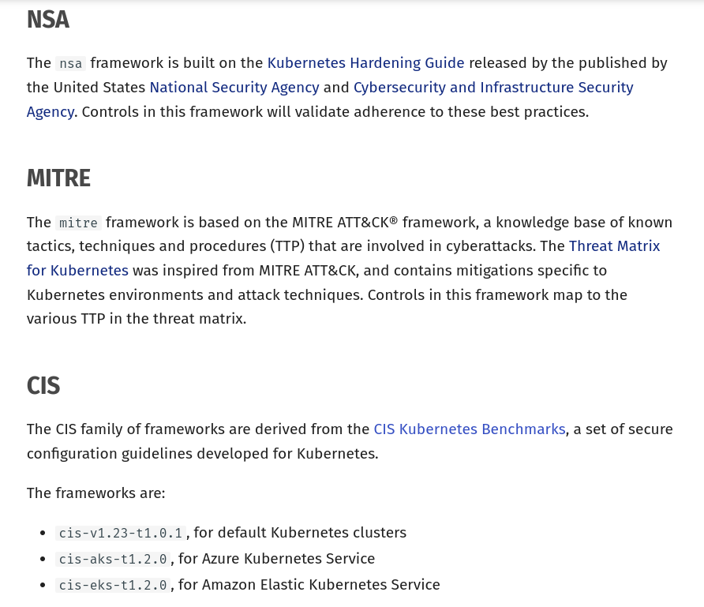
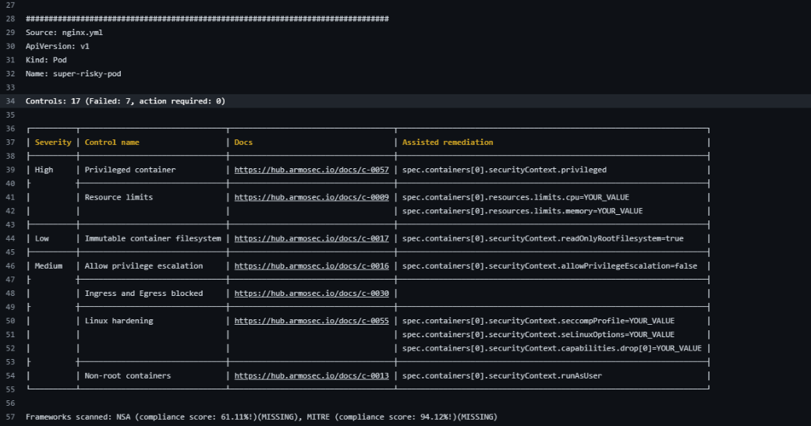

# Kubescape


## Running in minikube
```bash
minikube config set cpu 4
minikube start
kubectx minikube
```


## Installing Kubescape

https://kubescape.io/docs/install-cli/

```bash
curl -s https://raw.githubusercontent.com/kubescape/kubescape/master/install.sh | /bin/bash
```

Then, whether you are using `bash` or `zsh`:
```bash
export PATH=$PATH:/home/hiago.rabelo/.kubescape/bin
```

or for `fish`:
```bash
set -U fish_user_paths /home/hiago.rabelo/.kubescape/bin $fish_user_paths
```

Explanation:
- `set`: Command to set variables in fish.
- `-U`: This flag ensures the variable is universal, meaning it will persist across all sessions of fish.
- `fish_user_paths`: This is a fish-specific variable that allows you to prepend paths to the PATH environment variable.


## Scanning Cluster

```bash
kubescape scan
```
Search for vulnerabilities and compliance issues.

Table description:
- Severity: The risk associated.
- Control name: rule name. A set of controls is named framework.
- Failed resources: How many files failed among the next column.
- All resources: The total (EKS resources, like deployments, ConfigMaps, Secrets, etc....)
- Compliance Score: 
$(Failed - Total) / Total$


## Scanning files
[Reference](https://kubescape.io/docs/scanning/#verbose-mode)

Kubescape can be used to scan local YAML/JSON files before they are deployed to Kubernetes. This is a common use case for integrations into CI/CD systems; see Integrations for how this can be used.

### Scan local YAML/JSON files before deploying:
```bash
kubescape scan *.yml

# or the command bellow to scan a directory
# kubescape scan </path/to/directory>
```

### Scan Kubernetes manifest files from a Git repository:
```bash
kubescape scan https://github.com/kubescape/kubescape
```

### Scan Helm charts:

```bash
kubescape scan </path/to/directory>
```
**Note**: Kubescape will load the default VALUES file.

## Frameworks
[Reference](https://kubescape.io/docs/frameworks-and-controls/frameworks/)

```bash
kubescape list frameworks
```



### Stopping the pipe according to the severity (string) found
```bash
#SEVERITY: low, medium, high, critical
SEVERITY=low

# Scanning the cluster
kubescape scan framework nsa --severity-threshold $SEVERITY
kubescape scan framework mitre --severity-threshold $SEVERITY

# Scanning files
kubescape scan framework nsa --severity-threshold $SEVERITY .
kubescape scan framework mitre --severity-threshold $SEVERITY .
```

### Stopping the pipe according to the compliance (% number) found
```bash
# Scanning the cluster
kubescape scan mitre --compliance-threshold 80

# Scanning files
kubescape scan mitre --compliance-threshold 80 .
```

### Practical example (yaml)
Yaml file with security problems. This example show us how to stop our pipeline execution in case of compliance issues.
```bash
kubescape scan framework nsa --severity-threshold high examples/yaml/unsecure-nginx-app.yml
```


Yaml file with security problems fixed
```bash
kubescape scan framework nsa --severity-threshold high examples/yaml/secure-nginx-app.yml
```
In the command above, no `high` compliance problems were found. So the pipeline would continue properly.

### Practical example (helm chart)

The helm chart example was created using only:
```bash
cd examples
helm create nginx-chart
```
Searching for issues security
```bash
# WARNING: you need be inside the folder, otherwise, it will analyze the earlier example as well
cd examples/nginx-chart

kubescape scan framework nsa --severity-threshold high nginx-chart .
```

To see the details, like the files related to each issue, then run again with `--verbose`

```bash
kubescape scan framework nsa --severity-threshold high nginx-chart . --verbose
```


## Output formats
[Reference](https://kubescape.io/docs/scanning/#output-formats)

The default output format for a Kubescape scan is a "pretty-printed" table view. Other formats are also available:

### JSON:
```bash
kubescape scan --format json --format-version v2 --output results.json
```

### PDF:
Nice format to be used in a PowerPoint presentation.
```bash
kubescape scan --format pdf --output results.pdf
```

### Prometheus metrics:
```bash
kubescape scan --format prometheus
```

### HTML
```bash
kubescape scan --format html --output results.html
```


## Github Actions
[Reference](https://kubescape.io/docs/guides/kubescape-gha/#the-deployment)

- Create a main.yml file within a newly created `.github/workflows/` directory

```bash
mkdir -p .github/workflows && touch .github/workflows/main.yml
```

- Open `main.yml` and paste in the following code to get us started:

```yaml
name: Kubescape scanning for misconfigurations
on: [pull_request]
jobs:
  kubescape:
    runs-on: ubuntu-latest
    permissions:
      actions: read
      contents: read
      security-events: write
    steps:
    - uses: actions/checkout@v3
    - uses: kubescape/github-action@main
      continue-on-error: false
      with:
        frameworks: NSA,MITRE
        verbose: true
    severityThreshold: low
```

Output example:




If you click on each docs link, you can see the information about each control and how to fix it. **The assistent remediation column also gives you tips on how to fix it.**

## Integrating with GitLab CI/CD
[Reference](https://hub.armosec.io/docs/gitlab)

- Create a YAML file in your repository named `.gitlab-ci.yml`.
- Add the following to the file:


```yaml
image: bash:latest
stages:
    - scan
scan:
  stage: scan
  script:
    - apk add curl gcompat
    - curl -s https://raw.githubusercontent.com/kubescape/kubescape/master/install.sh | bash 
    - kubescape scan .
```


## Image scanning


Kubescape can scan container images for vulnerabilities. It uses Grype to scan the images.


### Scan image

```bash
kubescape scan image nginx:1.19.6
```

### Scan image from a private registry

```bash
kubescape scan image --username myuser --password mypassword myregistry/nginx:1.19.6
```

### Scan image and see full report

```bash
kubescape scan image nginx:1.19.6 -v
```

